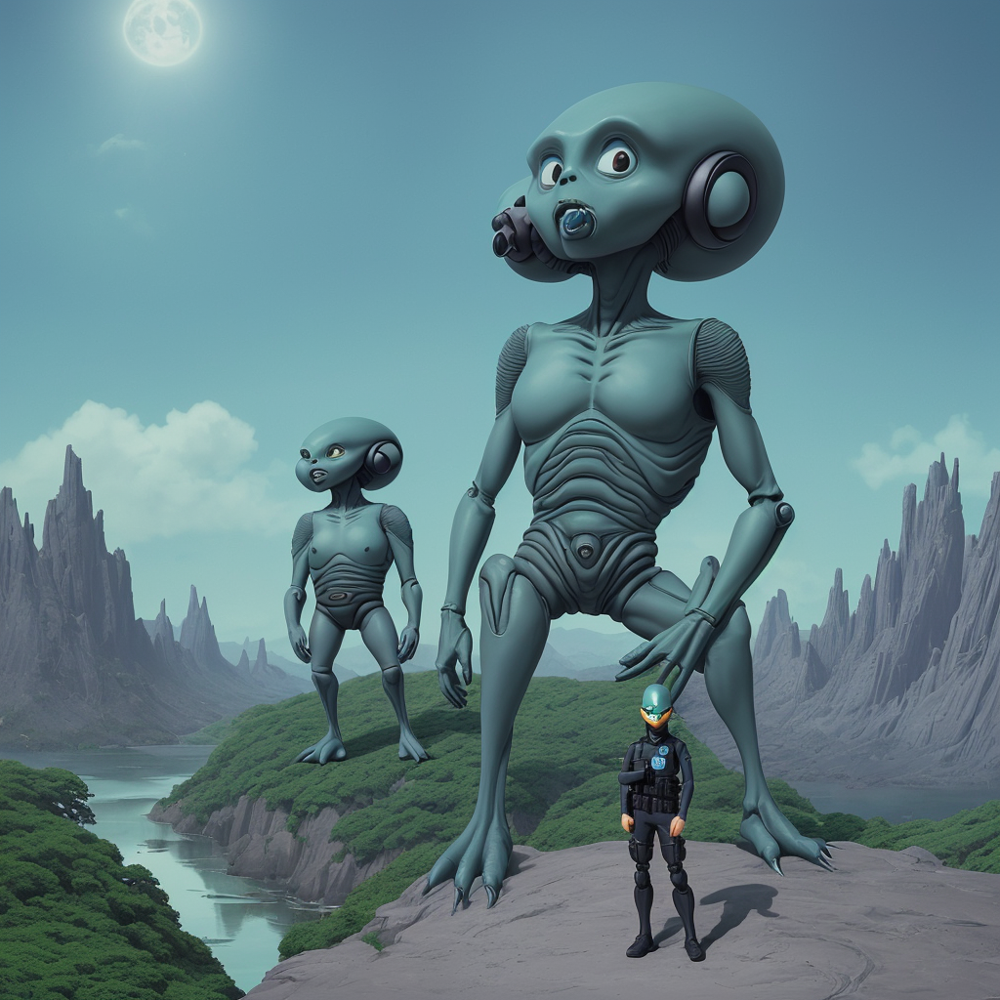

### 📷 082cc9edc47453f1f8a75e4da4a4f44b 

| Field          | Value                                                                                                                     |
|----------------|---------------------------------------------------------------------------------------------------------------------------|
| **Image ID**             | 082cc9edc47453f1f8a75e4da4a4f44b                                                                                                             |
| **Title**           | Alien Police Patrol in the Enchanted Forest                                                                                                       |
| **Description**           | Create a landscape full body image of a alien police in the style of Studio Ghibli                                                                                                       |
| **CreatedAt**        | 2024-12-19 01:29:17.589887                                                                                                        |
| **Model**        | dreamshaper                                                                                                        |
| **OpenAI**         | [OpenAI Image URL](http://192.168.1.85:8081/generated-images/b643324512449.png)                                                                                |
| **GitHub**         | [GitHub Image URL](https://raw.githubusercontent.com/Caneta-Silva/weeb/refs/heads/main/images/082cc9edc47453f1f8a75e4da4a4f44b/082cc9edc47453f1f8a75e4da4a4f44b.jpg)                                                                                |
| **Tags**       | None                                                                                                                   |

### 📜 c35fb1c070eed0ebf6ac87d7004b66b2

> Create a landscape full body image of a alien police in the style of Studio Ghibli

| Field          | Value                                                                                                                                                                      |
|----------------|----------------------------------------------------------------------------------------------------------------------------------------------------------------------------|
| **Prompt ID**  | c35fb1c070eed0ebf6ac87d7004b66b2                                                                                                                                                            |
| **Prompt History** | <ul><li>**Input:**    **Output:**    **Type:** </li></ul> |
| **Created At** |                                                                                                                                                    |
| **Revised At** | None                                                                                                                                                   |
| **Revised Prompt** | No                                                                                                                                                                      |
| **Enhanced At** | None                                                                                                                                                  |
| **Enhanced Prompt** | No                                                                                                                                                                    |

| **Template**   | Create a {{ aspect_ratio }} {{ modifiers.image }} image of a {{ modifiers.element }} {{ element }} in the style of {{ style }}                                                                                                                                           |

