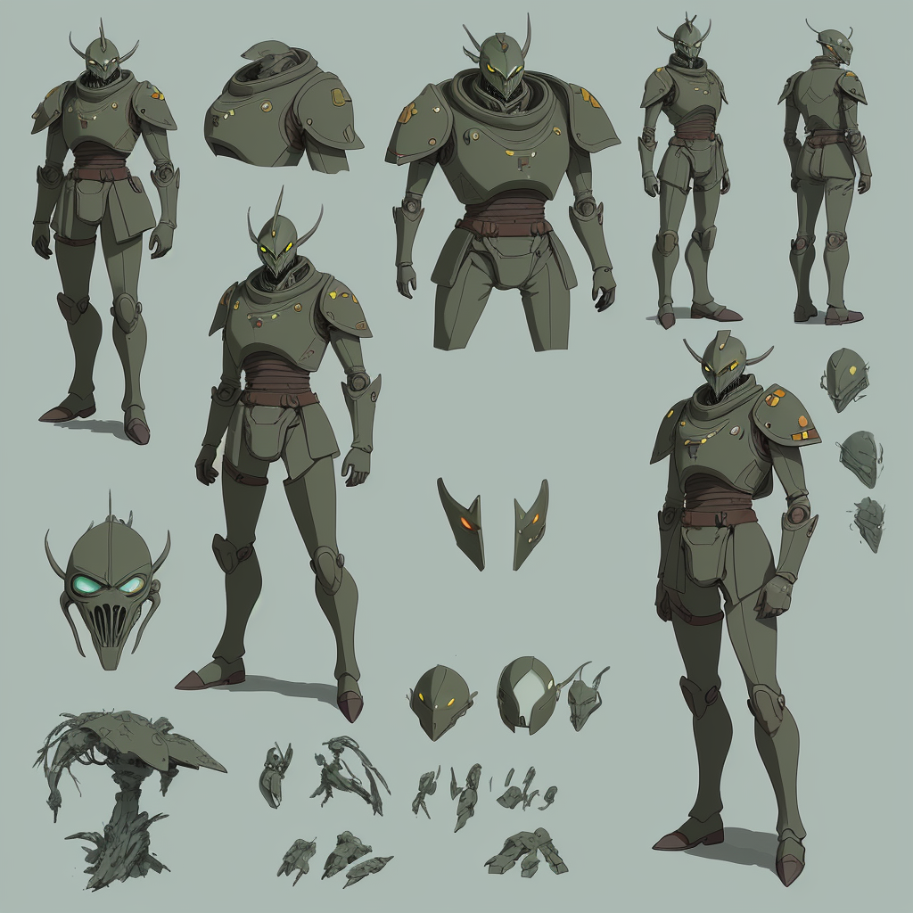
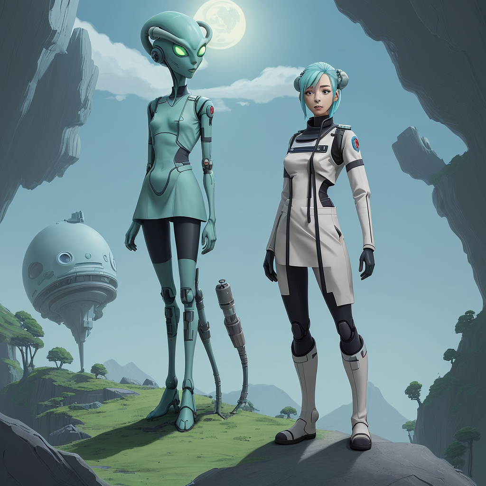
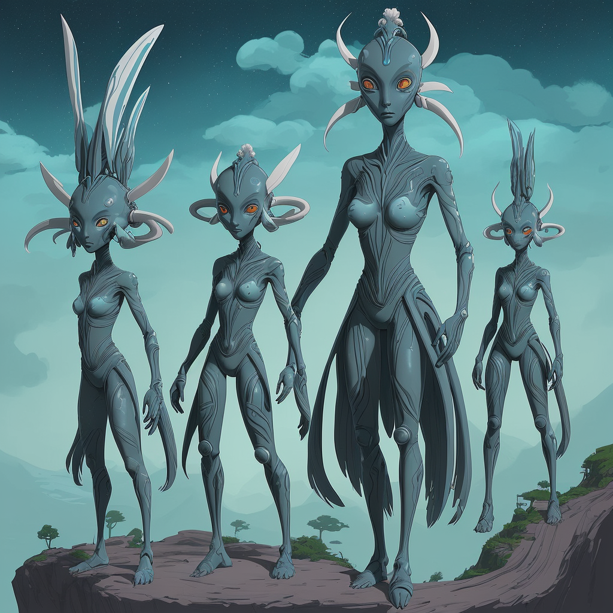
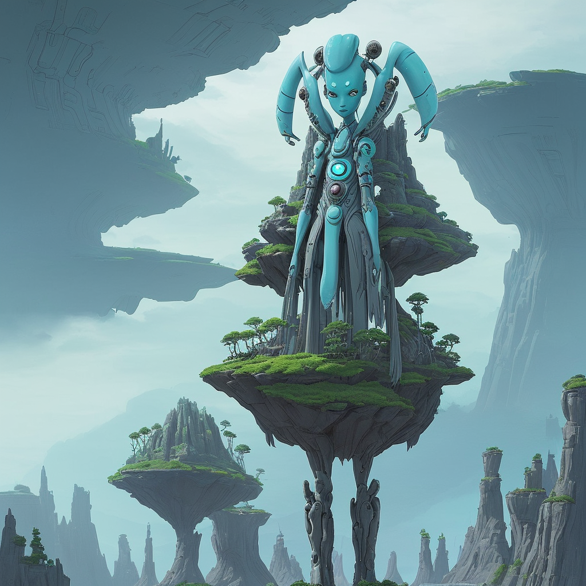
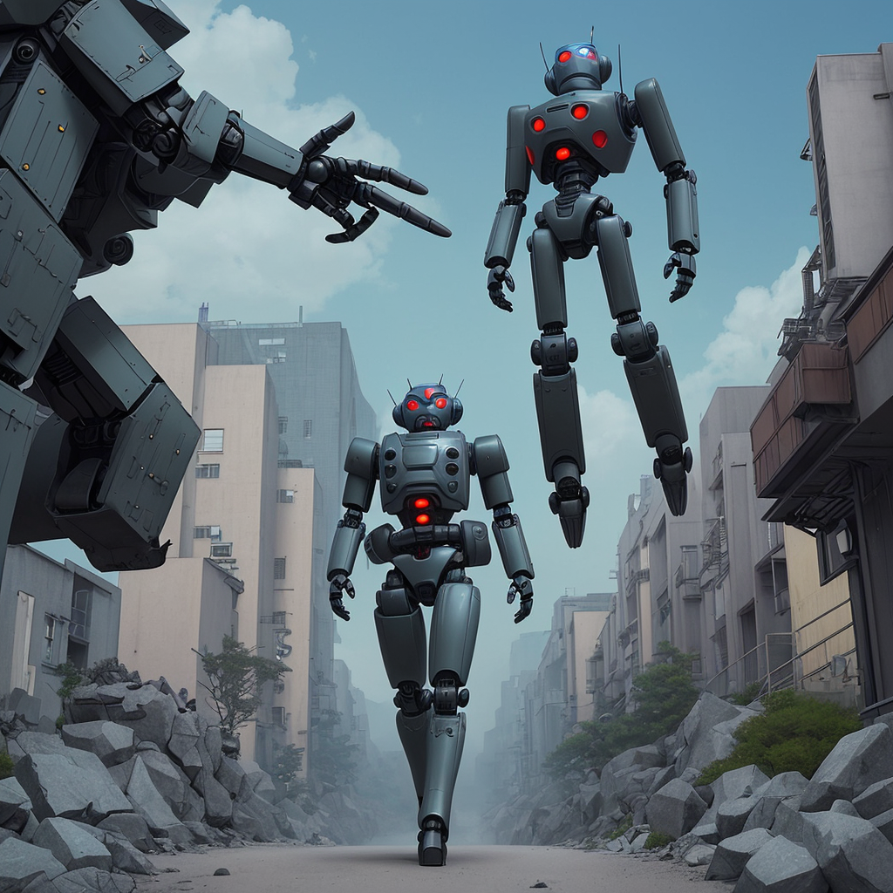
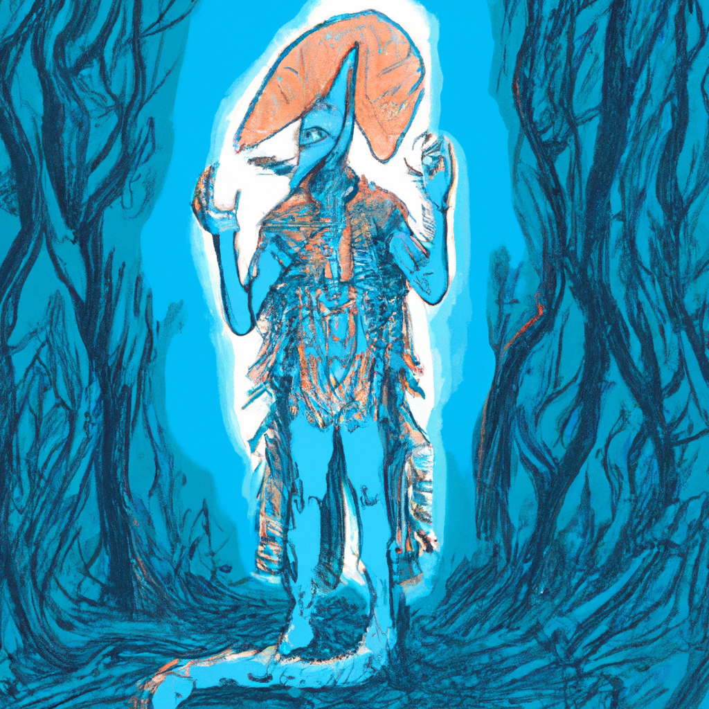
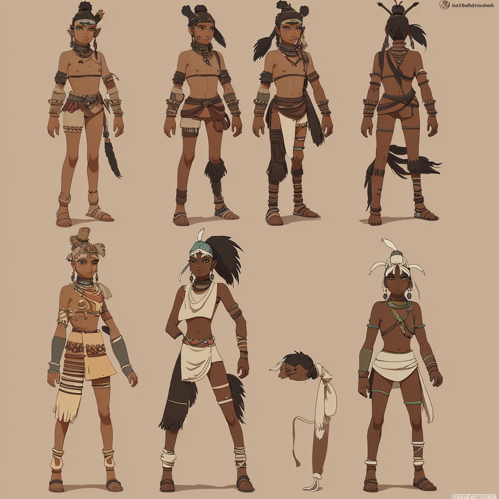
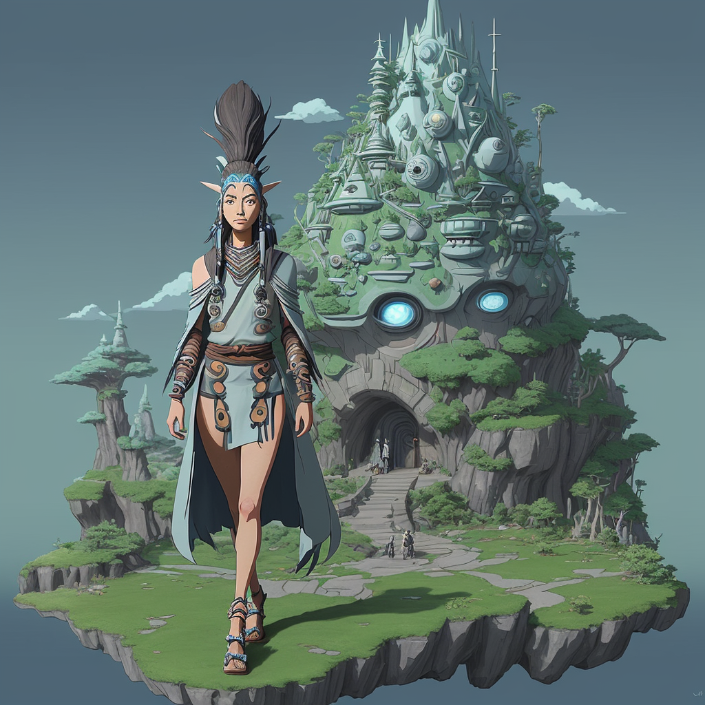
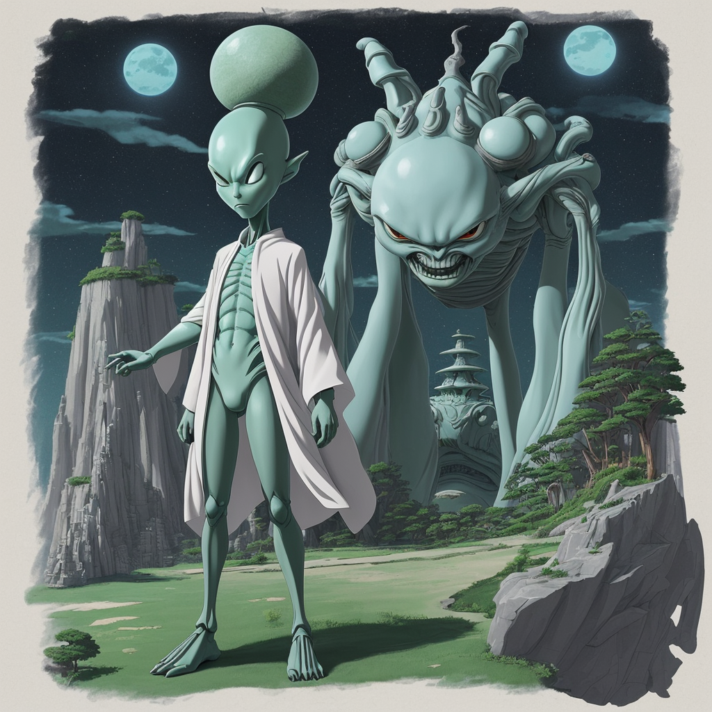

### 📷 2692d5d19ec6b47f5ee135f3261135d0 

| Field          | Value                                                                                                                     |
|----------------|---------------------------------------------------------------------------------------------------------------------------|
| **Image ID**             | 2692d5d19ec6b47f5ee135f3261135d0                                                                                                             |
| **Title**           | Alien Paladin in the Style of Studio Ghibli                                                                                                       |
| **Description**           | Create a landscape full body image of a alien paladin style military in the style of Studio Ghibli                                                                                                       |
| **CreatedAt**        | 2024-12-15 21:17:33.644995                                                                                                        |
| **Model**        | dreamshaper                                                                                                        |
| **OpenAI**         | [OpenAI Image URL](http://192.168.1.85:8081/generated-images/b641328104573.png)                                                                                |
| **GitHub**         | [GitHub Image URL](https://raw.githubusercontent.com/Caneta-Silva/weeb/refs/heads/main/images/2692d5d19ec6b47f5ee135f3261135d0/2692d5d19ec6b47f5ee135f3261135d0.jpg)                                                                                |
| **Tags**       | None                                                                                                                   |

### 📜 3ba8736105981be7a9f71461373f4a0d

> Create a landscape full body image of a alien paladin style military in the style of Studio Ghibli

| Field          | Value                                                                                                                                                                      |
|----------------|----------------------------------------------------------------------------------------------------------------------------------------------------------------------------|
| **Prompt ID**  | 3ba8736105981be7a9f71461373f4a0d                                                                                                                                                            |
| **Prompt History** | <ul><li>**Input:**    **Output:**    **Type:** </li></ul> |
| **Created At** |                                                                                                                                                    |
| **Revised At** | None                                                                                                                                                   |
| **Revised Prompt** | No                                                                                                                                                                      |
| **Enhanced At** | None                                                                                                                                                  |
| **Enhanced Prompt** | No                                                                                                                                                                    |
| **Metadata**   | <ul><li>**Element:** paladin style military   **Style:** Studio Ghibli   **Aspect Ratio:** landscape   **Backdrop:** spaceship   **Animal:** elephant   **Modifiers:**<ul><li>**Image:** full body</li><li>**Element:** alien</li><li>**Backdrop:** futuristic alien</li></ul></li></ul> |
| **Template**   | Create a {{ aspect_ratio }} {{ modifiers.image }} image of a {{ modifiers.element }} {{ element }} in the style of {{ style }}                                                                                                                                           |

### 📷 9c57e0cbd06d3f9fa0c31598d2232ec3 

| Field          | Value                                                                                                                     |
|----------------|---------------------------------------------------------------------------------------------------------------------------|
| **Image ID**             | 9c57e0cbd06d3f9fa0c31598d2232ec3                                                                                                             |
| **Title**           | Futuristic Alien Medic in Studio Ghibli Style                                                                                                       |
| **Description**           | Futuristic Alien Medic in Studio Ghibli Style                                                                                                       |
| **CreatedAt**        | 2024-12-16 18:44:15.443688                                                                                                        |
| **Model**        | dreamshaper                                                                                                        |
| **OpenAI**         | [OpenAI Image URL](http://192.168.1.85:8081/generated-images/b641953131922.png)                                                                                |
| **GitHub**         | [GitHub Image URL](https://raw.githubusercontent.com/Caneta-Silva/weeb/refs/heads/main/images/9c57e0cbd06d3f9fa0c31598d2232ec3/9c57e0cbd06d3f9fa0c31598d2232ec3.jpg)                                                                                |
| **Tags**       | None                                                                                                                   |

### 📜 e5091205512dd29e01196283949c360c

> Create a landscape full body image of a futuristic alien medic in the style of Studio Ghibli

| Field          | Value                                                                                                                                                                      |
|----------------|----------------------------------------------------------------------------------------------------------------------------------------------------------------------------|
| **Prompt ID**  | e5091205512dd29e01196283949c360c                                                                                                                                                            |
| **Prompt History** | <ul><li>**Input:**    **Output:**    **Type:** </li></ul> |
| **Created At** |                                                                                                                                                    |
| **Revised At** | None                                                                                                                                                   |
| **Revised Prompt** | No                                                                                                                                                                      |
| **Enhanced At** | None                                                                                                                                                  |
| **Enhanced Prompt** | No                                                                                                                                                                    |
| **Metadata**   | <ul><li>**Element:** medic   **Style:** Studio Ghibli   **Aspect Ratio:** landscape   **Backdrop:** waterfall   **Animal:** giraffe   **Modifiers:**<ul><li>**Image:** full body</li><li>**Element:** futuristic alien</li><li>**Backdrop:** futuristic</li></ul></li></ul> |
| **Template**   | Create a {{ aspect_ratio }} {{ modifiers.image }} image of a {{ modifiers.element }} {{ element }} in the style of {{ style }}                                                                                                                                           |

### 📷 ae41bafc14b4099a860f5590df3aac48 

| Field          | Value                                                                                                                     |
|----------------|---------------------------------------------------------------------------------------------------------------------------|
| **Image ID**             | ae41bafc14b4099a860f5590df3aac48                                                                                                             |
| **Title**           | Cosmic Healer: An Alien Medic's Journey                                                                                                       |
| **Description**           | Cosmic Healer: An Alien Medic's Journey                                                                                                       |
| **CreatedAt**        | 2024-12-16 18:39:10.027965                                                                                                        |
| **Model**        | dreamshaper                                                                                                        |
| **OpenAI**         | [OpenAI Image URL](http://192.168.1.85:8081/generated-images/b64605341979.png)                                                                                |
| **GitHub**         | [GitHub Image URL](https://raw.githubusercontent.com/Caneta-Silva/weeb/refs/heads/main/images/ae41bafc14b4099a860f5590df3aac48/ae41bafc14b4099a860f5590df3aac48.jpg)                                                                                |
| **Tags**       | None                                                                                                                   |

### 📜 7138cfa21def640b0e5823ccbdb9b1e3

> Create a landscape full body image of a alien medic in the style of Studio Ghibli

| Field          | Value                                                                                                                                                                      |
|----------------|----------------------------------------------------------------------------------------------------------------------------------------------------------------------------|
| **Prompt ID**  | 7138cfa21def640b0e5823ccbdb9b1e3                                                                                                                                                            |
| **Prompt History** | <ul><li>**Input:**    **Output:**    **Type:** </li></ul> |
| **Created At** |                                                                                                                                                    |
| **Revised At** | None                                                                                                                                                   |
| **Revised Prompt** | No                                                                                                                                                                      |
| **Enhanced At** | None                                                                                                                                                  |
| **Enhanced Prompt** | No                                                                                                                                                                    |
| **Metadata**   | <ul><li>**Element:** medic   **Style:** Studio Ghibli   **Aspect Ratio:** landscape   **Backdrop:** tropical forest   **Animal:** giraffe   **Modifiers:**<ul><li>**Image:** full body</li><li>**Element:** alien</li><li>**Backdrop:** futuristic alien</li></ul></li></ul> |
| **Template**   | Create a {{ aspect_ratio }} {{ modifiers.image }} image of a {{ modifiers.element }} {{ element }} in the style of {{ style }}                                                                                                                                           |

### 📷 140aaf711fce6bfb4ed0207323299d9d 

| Field          | Value                                                                                                                     |
|----------------|---------------------------------------------------------------------------------------------------------------------------|
| **Image ID**             | 140aaf711fce6bfb4ed0207323299d9d                                                                                                             |
| **Title**           | Futuristic Alien Paladin: A Studio Ghibli-Inspired Masterpiece                                                                                                       |
| **Description**           | Create a landscape full body image of a futuristic alien paladin style military in the style of Studio Ghibli                                                                                                       |
| **CreatedAt**        | 2024-12-16 18:41:26.543428                                                                                                        |
| **Model**        | dreamshaper                                                                                                        |
| **OpenAI**         | [OpenAI Image URL](http://192.168.1.85:8081/generated-images/b643472691688.png)                                                                                |
| **GitHub**         | [GitHub Image URL](https://raw.githubusercontent.com/Caneta-Silva/weeb/refs/heads/main/images/140aaf711fce6bfb4ed0207323299d9d/140aaf711fce6bfb4ed0207323299d9d.jpg)                                                                                |
| **Tags**       | None                                                                                                                   |

### 📜 bda1a7d912cd3fb8ff0a9aee6fd6fa00

> Create a landscape full body image of a futuristic alien paladin style military in the style of Studio Ghibli

| Field          | Value                                                                                                                                                                      |
|----------------|----------------------------------------------------------------------------------------------------------------------------------------------------------------------------|
| **Prompt ID**  | bda1a7d912cd3fb8ff0a9aee6fd6fa00                                                                                                                                                            |
| **Prompt History** | <ul><li>**Input:**    **Output:**    **Type:** </li></ul> |
| **Created At** |                                                                                                                                                    |
| **Revised At** | None                                                                                                                                                   |
| **Revised Prompt** | No                                                                                                                                                                      |
| **Enhanced At** | None                                                                                                                                                  |
| **Enhanced Prompt** | No                                                                                                                                                                    |
| **Metadata**   | <ul><li>**Element:** paladin style military   **Style:** Studio Ghibli   **Aspect Ratio:** landscape   **Backdrop:** spaceship   **Animal:** gnu   **Modifiers:**<ul><li>**Image:** full body</li><li>**Element:** futuristic alien</li><li>**Backdrop:** alien</li></ul></li></ul> |
| **Template**   | Create a {{ aspect_ratio }} {{ modifiers.image }} image of a {{ modifiers.element }} {{ element }} in the style of {{ style }}                                                                                                                                           |

### 📷 b8f7563acbc523f0d3eef10f87c671c1 

| Field          | Value                                                                                                                     |
|----------------|---------------------------------------------------------------------------------------------------------------------------|
| **Image ID**             | b8f7563acbc523f0d3eef10f87c671c1                                                                                                             |
| **Title**           | Futuristic Alien Tribe Warrior of the Great Forest                                                                                                       |
| **Description**           | Create a landscape full body image of a futuristic alien tribe warrior in the style of Studio Ghibli                                                                                                       |
| **CreatedAt**        | 2024-12-16 18:47:13.588667                                                                                                        |
| **Model**        | dreamshaper                                                                                                        |
| **OpenAI**         | [OpenAI Image URL](http://192.168.1.85:8081/generated-images/b643594126759.png)                                                                                |
| **GitHub**         | [GitHub Image URL](https://raw.githubusercontent.com/Caneta-Silva/weeb/refs/heads/main/images/b8f7563acbc523f0d3eef10f87c671c1/b8f7563acbc523f0d3eef10f87c671c1.jpg)                                                                                |
| **Tags**       | None                                                                                                                   |

### 📜 cf9509a07ddd2759a1d6b1589676960f

> Create a landscape full body image of a futuristic alien tribe warrior in the style of Studio Ghibli

| Field          | Value                                                                                                                                                                      |
|----------------|----------------------------------------------------------------------------------------------------------------------------------------------------------------------------|
| **Prompt ID**  | cf9509a07ddd2759a1d6b1589676960f                                                                                                                                                            |
| **Prompt History** | <ul><li>**Input:**    **Output:**    **Type:** </li></ul> |
| **Created At** |                                                                                                                                                    |
| **Revised At** | None                                                                                                                                                   |
| **Revised Prompt** | No                                                                                                                                                                      |
| **Enhanced At** | None                                                                                                                                                  |
| **Enhanced Prompt** | No                                                                                                                                                                    |
| **Metadata**   | <ul><li>**Element:** tribe warrior   **Style:** Studio Ghibli   **Aspect Ratio:** landscape   **Backdrop:** forest   **Animal:** deer   **Modifiers:**<ul><li>**Image:** full body</li><li>**Element:** futuristic alien</li><li>**Backdrop:** futuristic alien</li></ul></li></ul> |
| **Template**   | Create a {{ aspect_ratio }} {{ modifiers.image }} image of a {{ modifiers.element }} {{ element }} in the style of {{ style }}                                                                                                                                           |

### 📷 d9f8b2f0cedbd9e16b4d597f289c6327 

| Field          | Value                                                                                                                     |
|----------------|---------------------------------------------------------------------------------------------------------------------------|
| **Image ID**             | d9f8b2f0cedbd9e16b4d597f289c6327                                                                                                             |
| **Title**           | Futuristic Medic in Studio Ghibli Style                                                                                                       |
| **Description**           | Create a landscape full body image of a futuristic medic in the style of Studio Ghibli                                                                                                       |
| **CreatedAt**        | 2024-12-16 18:42:54.810512                                                                                                        |
| **Model**        | dreamshaper                                                                                                        |
| **OpenAI**         | [OpenAI Image URL](http://192.168.1.85:8081/generated-images/b64961680476.png)                                                                                |
| **GitHub**         | [GitHub Image URL](https://raw.githubusercontent.com/Caneta-Silva/weeb/refs/heads/main/images/d9f8b2f0cedbd9e16b4d597f289c6327/d9f8b2f0cedbd9e16b4d597f289c6327.jpg)                                                                                |
| **Tags**       | None                                                                                                                   |

### 📜 207d68dddef76b082e410abcc4d4aa0c

> Create a landscape full body image of a futuristic medic in the style of Studio Ghibli

| Field          | Value                                                                                                                                                                      |
|----------------|----------------------------------------------------------------------------------------------------------------------------------------------------------------------------|
| **Prompt ID**  | 207d68dddef76b082e410abcc4d4aa0c                                                                                                                                                            |
| **Prompt History** | <ul><li>**Input:**    **Output:**    **Type:** </li></ul> |
| **Created At** |                                                                                                                                                    |
| **Revised At** | None                                                                                                                                                   |
| **Revised Prompt** | No                                                                                                                                                                      |
| **Enhanced At** | None                                                                                                                                                  |
| **Enhanced Prompt** | No                                                                                                                                                                    |
| **Metadata**   | <ul><li>**Element:** medic   **Style:** Studio Ghibli   **Aspect Ratio:** landscape   **Backdrop:** forest   **Animal:** horse   **Modifiers:**<ul><li>**Image:** full body</li><li>**Element:** futuristic</li><li>**Backdrop:** futuristic alien</li></ul></li></ul> |
| **Template**   | Create a {{ aspect_ratio }} {{ modifiers.image }} image of a {{ modifiers.element }} {{ element }} in the style of {{ style }}                                                                                                                                           |

### 📷 bbe1f1e4f1bbc798b833b419a9eca3a0 

| Field          | Value                                                                                                                     |
|----------------|---------------------------------------------------------------------------------------------------------------------------|
| **Image ID**             | bbe1f1e4f1bbc798b833b419a9eca3a0                                                                                                             |
| **Title**           | Futuristic Riot Police Robot in Studio Ghibli Style                                                                                                       |
| **Description**           | Futuristic Riot Police Robot in Studio Ghibli Style                                                                                                       |
| **CreatedAt**        | 2024-12-16 18:48:55.495159                                                                                                        |
| **Model**        | dreamshaper                                                                                                        |
| **OpenAI**         | [OpenAI Image URL](http://192.168.1.85:8081/generated-images/b642918420562.png)                                                                                |
| **GitHub**         | [GitHub Image URL](https://raw.githubusercontent.com/Caneta-Silva/weeb/refs/heads/main/images/bbe1f1e4f1bbc798b833b419a9eca3a0/bbe1f1e4f1bbc798b833b419a9eca3a0.jpg)                                                                                |
| **Tags**       | None                                                                                                                   |

### 📜 61d9f0cb8dfcd93c7199121dda0a6cf9

> Create a landscape full body image of a futuristic riot police robot in the style of Studio Ghibli

| Field          | Value                                                                                                                                                                      |
|----------------|----------------------------------------------------------------------------------------------------------------------------------------------------------------------------|
| **Prompt ID**  | 61d9f0cb8dfcd93c7199121dda0a6cf9                                                                                                                                                            |
| **Prompt History** | <ul><li>**Input:**    **Output:**    **Type:** </li></ul> |
| **Created At** |                                                                                                                                                    |
| **Revised At** | None                                                                                                                                                   |
| **Revised Prompt** | No                                                                                                                                                                      |
| **Enhanced At** | None                                                                                                                                                  |
| **Enhanced Prompt** | No                                                                                                                                                                    |
| **Metadata**   | <ul><li>**Element:** riot police robot   **Style:** Studio Ghibli   **Aspect Ratio:** landscape   **Backdrop:** desert   **Animal:** camel   **Modifiers:**<ul><li>**Image:** full body</li><li>**Element:** futuristic</li><li>**Backdrop:** futuristic alien</li></ul></li></ul> |
| **Template**   | Create a {{ aspect_ratio }} {{ modifiers.image }} image of a {{ modifiers.element }} {{ element }} in the style of {{ style }}                                                                                                                                           |

### 📷 006e64737e0cc3ba620118495f38f953 

| Field          | Value                                                                                                                     |
|----------------|---------------------------------------------------------------------------------------------------------------------------|
| **Image ID**             | 006e64737e0cc3ba620118495f38f953                                                                                                             |
| **Title**           | Futuristic Alien Tribe Chief in Studio Ghibli Style                                                                                                       |
| **Description**           | Create a landscape full body image of a futuristic alien tribe chief in the style of Studio Ghibli                                                                                                       |
| **CreatedAt**        | 2024-12-16 14:23:38.573786                                                                                                        |
| **Model**        | dreamshaper                                                                                                        |
| **OpenAI**         | [OpenAI Image URL](http://192.168.1.85:8081/generated-images/b643676450115.png)                                                                                |
| **GitHub**         | [GitHub Image URL](https://raw.githubusercontent.com/Caneta-Silva/weeb/refs/heads/main/images/006e64737e0cc3ba620118495f38f953/006e64737e0cc3ba620118495f38f953.jpg)                                                                                |
| **Tags**       | None                                                                                                                   |

### 📜 7717b38f64c5999062503d0cc37e9428

> Create a landscape full body image of a futuristic alien tribe chief in the style of Studio Ghibli

| Field          | Value                                                                                                                                                                      |
|----------------|----------------------------------------------------------------------------------------------------------------------------------------------------------------------------|
| **Prompt ID**  | 7717b38f64c5999062503d0cc37e9428                                                                                                                                                            |
| **Prompt History** | <ul><li>**Input:**    **Output:**    **Type:** </li></ul> |
| **Created At** |                                                                                                                                                    |
| **Revised At** | None                                                                                                                                                   |
| **Revised Prompt** | No                                                                                                                                                                      |
| **Enhanced At** | None                                                                                                                                                  |
| **Enhanced Prompt** | No                                                                                                                                                                    |
| **Metadata**   | <ul><li>**Element:** tribe chief   **Style:** Studio Ghibli   **Aspect Ratio:** landscape   **Backdrop:** desert   **Animal:** camel   **Modifiers:**<ul><li>**Image:** full body</li><li>**Element:** futuristic alien</li><li>**Backdrop:** futuristic alien</li></ul></li></ul> |
| **Template**   | Create a {{ aspect_ratio }} {{ modifiers.image }} image of a {{ modifiers.element }} {{ element }} in the style of {{ style }}                                                                                                                                           |

### 📷 910654802183cd09c63bc714ed0dbeb5 

| Field          | Value                                                                                                                     |
|----------------|---------------------------------------------------------------------------------------------------------------------------|
| **Image ID**             | 910654802183cd09c63bc714ed0dbeb5                                                                                                             |
| **Title**           | Galactic Sentinel: Alien Riot Police Robot                                                                                                       |
| **Description**           | Galactic Sentinel: Alien Riot Police Robot                                                                                                       |
| **CreatedAt**        | 2024-12-16 14:15:53.378279                                                                                                        |
| **Model**        | dreamshaper                                                                                                        |
| **OpenAI**         | [OpenAI Image URL](http://192.168.1.85:8081/generated-images/b644069663745.png)                                                                                |
| **GitHub**         | [GitHub Image URL](https://raw.githubusercontent.com/Caneta-Silva/weeb/refs/heads/main/images/910654802183cd09c63bc714ed0dbeb5/910654802183cd09c63bc714ed0dbeb5.jpg)                                                                                |
| **Tags**       | None                                                                                                                   |

### 📜 7ab93f85874f9da6fef339fd3573e4df

> Create a landscape full body image of a alien riot police robot in the style of Studio Ghibli

| Field          | Value                                                                                                                                                                      |
|----------------|----------------------------------------------------------------------------------------------------------------------------------------------------------------------------|
| **Prompt ID**  | 7ab93f85874f9da6fef339fd3573e4df                                                                                                                                                            |
| **Prompt History** | <ul><li>**Input:**    **Output:**    **Type:** </li></ul> |
| **Created At** |                                                                                                                                                    |
| **Revised At** | None                                                                                                                                                   |
| **Revised Prompt** | No                                                                                                                                                                      |
| **Enhanced At** | None                                                                                                                                                  |
| **Enhanced Prompt** | No                                                                                                                                                                    |
| **Metadata**   | <ul><li>**Element:** riot police robot   **Style:** Studio Ghibli   **Aspect Ratio:** landscape   **Backdrop:** fortress   **Animal:** rhino   **Modifiers:**<ul><li>**Image:** full body</li><li>**Element:** alien</li><li>**Backdrop:** futuristic</li></ul></li></ul> |
| **Template**   | Create a {{ aspect_ratio }} {{ modifiers.image }} image of a {{ modifiers.element }} {{ element }} in the style of {{ style }}                                                                                                                                           |

### 📷 9d4e8cfc6750ee90e8224f933f6631c3 

| Field          | Value                                                                                                                     |
|----------------|---------------------------------------------------------------------------------------------------------------------------|
| **Image ID**             | 9d4e8cfc6750ee90e8224f933f6631c3                                                                                                             |
| **Title**           | Wanderer of Tomorrow: The Futuristic Emperor                                                                                                       |
| **Description**           | Wanderer of Tomorrow: The Futuristic Emperor                                                                                                       |
| **CreatedAt**        | 2024-12-16 14:21:02.891499                                                                                                        |
| **Model**        | dreamshaper                                                                                                        |
| **OpenAI**         | [OpenAI Image URL](http://192.168.1.85:8081/generated-images/b643343043328.png)                                                                                |
| **GitHub**         | [GitHub Image URL](https://raw.githubusercontent.com/Caneta-Silva/weeb/refs/heads/main/images/9d4e8cfc6750ee90e8224f933f6631c3/9d4e8cfc6750ee90e8224f933f6631c3.jpg)                                                                                |
| **Tags**       | None                                                                                                                   |

### 📜 f958ed2a413061b5f34fdb2a3ce91be8

> Create a landscape full body image of a futuristic emperor in the style of Studio Ghibli

| Field          | Value                                                                                                                                                                      |
|----------------|----------------------------------------------------------------------------------------------------------------------------------------------------------------------------|
| **Prompt ID**  | f958ed2a413061b5f34fdb2a3ce91be8                                                                                                                                                            |
| **Prompt History** | <ul><li>**Input:**    **Output:**    **Type:** </li></ul> |
| **Created At** |                                                                                                                                                    |
| **Revised At** | None                                                                                                                                                   |
| **Revised Prompt** | No                                                                                                                                                                      |
| **Enhanced At** | None                                                                                                                                                  |
| **Enhanced Prompt** | No                                                                                                                                                                    |
| **Metadata**   | <ul><li>**Element:** emperor   **Style:** Studio Ghibli   **Aspect Ratio:** landscape   **Backdrop:** forest   **Animal:** camel   **Modifiers:**<ul><li>**Image:** full body</li><li>**Element:** futuristic</li><li>**Backdrop:** futuristic alien</li></ul></li></ul> |
| **Template**   | Create a {{ aspect_ratio }} {{ modifiers.image }} image of a {{ modifiers.element }} {{ element }} in the style of {{ style }}                                                                                                                                           |

### 📷 8d6bbe136a0cc5bd1766be5ed2fb7dd2 

| Field          | Value                                                                                                                     |
|----------------|---------------------------------------------------------------------------------------------------------------------------|
| **Image ID**             | 8d6bbe136a0cc5bd1766be5ed2fb7dd2                                                                                                             |
| **Title**           | Futuristic Alien Shaman in Studio Ghibli Style                                                                                                       |
| **Description**           | Futuristic Alien Shaman in Studio Ghibli Style                                                                                                       |
| **CreatedAt**        | 2024-12-16 14:19:25.633332                                                                                                        |
| **Model**        | dreamshaper                                                                                                        |
| **OpenAI**         | [OpenAI Image URL](http://192.168.1.85:8081/generated-images/b642299520515.png)                                                                                |
| **GitHub**         | [GitHub Image URL](https://raw.githubusercontent.com/Caneta-Silva/weeb/refs/heads/main/images/8d6bbe136a0cc5bd1766be5ed2fb7dd2/8d6bbe136a0cc5bd1766be5ed2fb7dd2.jpg)                                                                                |
| **Tags**       | None                                                                                                                   |

### 📜 394cdef58e3fe85eb9b64be50762f374

> Create a landscape full body image of a futuristic alien shaman in the style of Studio Ghibli

| Field          | Value                                                                                                                                                                      |
|----------------|----------------------------------------------------------------------------------------------------------------------------------------------------------------------------|
| **Prompt ID**  | 394cdef58e3fe85eb9b64be50762f374                                                                                                                                                            |
| **Prompt History** | <ul><li>**Input:**    **Output:**    **Type:** </li></ul> |
| **Created At** |                                                                                                                                                    |
| **Revised At** | None                                                                                                                                                   |
| **Revised Prompt** | No                                                                                                                                                                      |
| **Enhanced At** | None                                                                                                                                                  |
| **Enhanced Prompt** | No                                                                                                                                                                    |
| **Metadata**   | <ul><li>**Element:** shaman   **Style:** Studio Ghibli   **Aspect Ratio:** landscape   **Backdrop:** fortress   **Animal:** camel   **Modifiers:**<ul><li>**Image:** full body</li><li>**Element:** futuristic alien</li><li>**Backdrop:** alien</li></ul></li></ul> |
| **Template**   | Create a {{ aspect_ratio }} {{ modifiers.image }} image of a {{ modifiers.element }} {{ element }} in the style of {{ style }}                                                                                                                                           |

### 📷 5352413d4b455a76259826cb404c1930 

| Field          | Value                                                                                                                     |
|----------------|---------------------------------------------------------------------------------------------------------------------------|
| **Image ID**             | 5352413d4b455a76259826cb404c1930                                                                                                             |
| **Title**           | Futuristic Firefighter in Studio Ghibli Style                                                                                                       |
| **Description**           | Create a landscape full body image of a futuristic firefighter in the style of Studio Ghibli                                                                                                       |
| **CreatedAt**        | 2024-12-16 14:00:46.286847                                                                                                        |
| **Model**        | dreamshaper                                                                                                        |
| **OpenAI**         | [OpenAI Image URL](http://192.168.1.85:8081/generated-images/b641051311728.png)                                                                                |
| **GitHub**         | [GitHub Image URL](https://raw.githubusercontent.com/Caneta-Silva/weeb/refs/heads/main/images/5352413d4b455a76259826cb404c1930/5352413d4b455a76259826cb404c1930.jpg)                                                                                |
| **Tags**       | None                                                                                                                   |

### 📜 c823112dce17cf36ff4265b7bf3b67da

> Create a landscape full body image of a futuristic firefighter in the style of Studio Ghibli

| Field          | Value                                                                                                                                                                      |
|----------------|----------------------------------------------------------------------------------------------------------------------------------------------------------------------------|
| **Prompt ID**  | c823112dce17cf36ff4265b7bf3b67da                                                                                                                                                            |
| **Prompt History** | <ul><li>**Input:**    **Output:**    **Type:** </li></ul> |
| **Created At** |                                                                                                                                                    |
| **Revised At** | None                                                                                                                                                   |
| **Revised Prompt** | No                                                                                                                                                                      |
| **Enhanced At** | None                                                                                                                                                  |
| **Enhanced Prompt** | No                                                                                                                                                                    |
| **Metadata**   | <ul><li>**Element:** firefighter   **Style:** Studio Ghibli   **Aspect Ratio:** landscape   **Backdrop:** waterfall   **Animal:** gnu   **Modifiers:**<ul><li>**Image:** full body</li><li>**Element:** futuristic</li><li>**Backdrop:** alien</li></ul></li></ul> |
| **Template**   | Create a {{ aspect_ratio }} {{ modifiers.image }} image of a {{ modifiers.element }} {{ element }} in the style of {{ style }}                                                                                                                                           |

### 📷 f49a4869b1ea0c3e1007278dfdcf568f 

| Field          | Value                                                                                                                     |
|----------------|---------------------------------------------------------------------------------------------------------------------------|
| **Image ID**             | f49a4869b1ea0c3e1007278dfdcf568f                                                                                                             |
| **Title**           | Futuristic Desert Tribe Warrior in Studio Ghibli Style                                                                                                       |
| **Description**           | Create a landscape full body image of a futuristic desert tribe warrior in the style of Studio Ghibli                                                                                                       |
| **CreatedAt**        | 2024-12-15 22:04:54.977939                                                                                                        |
| **Model**        | dreamshaper                                                                                                        |
| **OpenAI**         | [OpenAI Image URL](http://192.168.1.85:8081/generated-images/b643279391278.png)                                                                                |
| **GitHub**         | [GitHub Image URL](https://raw.githubusercontent.com/Caneta-Silva/weeb/refs/heads/main/images/f49a4869b1ea0c3e1007278dfdcf568f/f49a4869b1ea0c3e1007278dfdcf568f.jpg)                                                                                |
| **Tags**       | None                                                                                                                   |

### 📜 428c05948bda35216929d6ee9072d762

> Create a landscape full body image of a futuristic desert tribe warrior in the style of Studio Ghibli

| Field          | Value                                                                                                                                                                      |
|----------------|----------------------------------------------------------------------------------------------------------------------------------------------------------------------------|
| **Prompt ID**  | 428c05948bda35216929d6ee9072d762                                                                                                                                                            |
| **Prompt History** | <ul><li>**Input:**    **Output:**    **Type:** </li></ul> |
| **Created At** |                                                                                                                                                    |
| **Revised At** | None                                                                                                                                                   |
| **Revised Prompt** | No                                                                                                                                                                      |
| **Enhanced At** | None                                                                                                                                                  |
| **Enhanced Prompt** | No                                                                                                                                                                    |
| **Metadata**   | <ul><li>**Element:** desert tribe warrior   **Style:** Studio Ghibli   **Aspect Ratio:** landscape   **Backdrop:** desert landscape   **Animal:** elephant   **Modifiers:**<ul><li>**Image:** full body</li><li>**Element:** futuristic</li><li>**Backdrop:** futuristic</li></ul></li></ul> |
| **Template**   | Create a {{ aspect_ratio }} {{ modifiers.image }} image of a {{ modifiers.element }} {{ element }} in the style of {{ style }}                                                                                                                                           |

### 📷 c654236276bf5d988438d32d8385d073 

| Field          | Value                                                                                                                     |
|----------------|---------------------------------------------------------------------------------------------------------------------------|
| **Image ID**             | c654236276bf5d988438d32d8385d073                                                                                                             |
| **Title**           | Futuristic Shaman in the Spirit of Studio Ghibli                                                                                                       |
| **Description**           | Create a landscape full body image of a futuristic shaman in the style of Studio Ghibli                                                                                                       |
| **CreatedAt**        | 2024-12-16 14:16:14.645333                                                                                                        |
| **Model**        | dreamshaper                                                                                                        |
| **OpenAI**         | [OpenAI Image URL](http://192.168.1.85:8081/generated-images/b641752213590.png)                                                                                |
| **GitHub**         | [GitHub Image URL](https://raw.githubusercontent.com/Caneta-Silva/weeb/refs/heads/main/images/c654236276bf5d988438d32d8385d073/c654236276bf5d988438d32d8385d073.jpg)                                                                                |
| **Tags**       | None                                                                                                                   |

### 📜 b4094781d21347fbff5f20db5697e159

> Create a landscape full body image of a futuristic shaman in the style of Studio Ghibli

| Field          | Value                                                                                                                                                                      |
|----------------|----------------------------------------------------------------------------------------------------------------------------------------------------------------------------|
| **Prompt ID**  | b4094781d21347fbff5f20db5697e159                                                                                                                                                            |
| **Prompt History** | <ul><li>**Input:**    **Output:**    **Type:** </li></ul> |
| **Created At** |                                                                                                                                                    |
| **Revised At** | None                                                                                                                                                   |
| **Revised Prompt** | No                                                                                                                                                                      |
| **Enhanced At** | None                                                                                                                                                  |
| **Enhanced Prompt** | No                                                                                                                                                                    |
| **Metadata**   | <ul><li>**Element:** shaman   **Style:** Studio Ghibli   **Aspect Ratio:** landscape   **Backdrop:** spaceship   **Animal:** camel   **Modifiers:**<ul><li>**Image:** full body</li><li>**Element:** futuristic</li><li>**Backdrop:** alien</li></ul></li></ul> |
| **Template**   | Create a {{ aspect_ratio }} {{ modifiers.image }} image of a {{ modifiers.element }} {{ element }} in the style of {{ style }}                                                                                                                                           |

### 📷 f07f9ca03229da7db143a6bba30d5be9 

| Field          | Value                                                                                                                     |
|----------------|---------------------------------------------------------------------------------------------------------------------------|
| **Image ID**             | f07f9ca03229da7db143a6bba30d5be9                                                                                                             |
| **Title**           | Alien Police in the Style of Studio Ghibli                                                                                                       |
| **Description**           | Create a landscape full body image of a alien police in the style of Studio Ghibli                                                                                                       |
| **CreatedAt**        | 2024-12-15 21:18:53.966036                                                                                                        |
| **Model**        | dreamshaper                                                                                                        |
| **OpenAI**         | [OpenAI Image URL](http://192.168.1.85:8081/generated-images/b642099288937.png)                                                                                |
| **GitHub**         | [GitHub Image URL](https://raw.githubusercontent.com/Caneta-Silva/weeb/refs/heads/main/images/f07f9ca03229da7db143a6bba30d5be9/f07f9ca03229da7db143a6bba30d5be9.jpg)                                                                                |
| **Tags**       | None                                                                                                                   |

### 📜 a5936b2244243bef191bdf9d6de2fd44

> Create a landscape full body image of a alien police in the style of Studio Ghibli

| Field          | Value                                                                                                                                                                      |
|----------------|----------------------------------------------------------------------------------------------------------------------------------------------------------------------------|
| **Prompt ID**  | a5936b2244243bef191bdf9d6de2fd44                                                                                                                                                            |
| **Prompt History** | <ul><li>**Input:**    **Output:**    **Type:** </li></ul> |
| **Created At** |                                                                                                                                                    |
| **Revised At** | None                                                                                                                                                   |
| **Revised Prompt** | No                                                                                                                                                                      |
| **Enhanced At** | None                                                                                                                                                  |
| **Enhanced Prompt** | No                                                                                                                                                                    |
| **Metadata**   | <ul><li>**Element:** police   **Style:** Studio Ghibli   **Aspect Ratio:** landscape   **Backdrop:** Martial landscape   **Animal:** gnu   **Modifiers:**<ul><li>**Image:** full body</li><li>**Element:** alien</li><li>**Backdrop:** futuristic alien</li></ul></li></ul> |
| **Template**   | Create a {{ aspect_ratio }} {{ modifiers.image }} image of a {{ modifiers.element }} {{ element }} in the style of {{ style }}                                                                                                                                           |

### 📷 98aea12a0515955e2ff39f82da9c7d0c 

| Field          | Value                                                                                                                     |
|----------------|---------------------------------------------------------------------------------------------------------------------------|
| **Image ID**             | 98aea12a0515955e2ff39f82da9c7d0c                                                                                                             |
| **Title**           | Futuristic Police Officer in a Studio Ghibli-Style Landscape                                                                                                       |
| **Description**           | Create a landscape full body image of a futuristic police in the style of Studio Ghibli                                                                                                       |
| **CreatedAt**        | 2024-12-16 18:45:47.921945                                                                                                        |
| **Model**        | dreamshaper                                                                                                        |
| **OpenAI**         | [OpenAI Image URL](http://192.168.1.85:8081/generated-images/b641732614241.png)                                                                                |
| **GitHub**         | [GitHub Image URL](https://raw.githubusercontent.com/Caneta-Silva/weeb/refs/heads/main/images/98aea12a0515955e2ff39f82da9c7d0c/98aea12a0515955e2ff39f82da9c7d0c.jpg)                                                                                |
| **Tags**       | None                                                                                                                   |

### 📜 11db45b5f9afd7ebcd55bed67c45102c

> Create a landscape full body image of a futuristic police in the style of Studio Ghibli

| Field          | Value                                                                                                                                                                      |
|----------------|----------------------------------------------------------------------------------------------------------------------------------------------------------------------------|
| **Prompt ID**  | 11db45b5f9afd7ebcd55bed67c45102c                                                                                                                                                            |
| **Prompt History** | <ul><li>**Input:**    **Output:**    **Type:** </li></ul> |
| **Created At** |                                                                                                                                                    |
| **Revised At** | None                                                                                                                                                   |
| **Revised Prompt** | No                                                                                                                                                                      |
| **Enhanced At** | None                                                                                                                                                  |
| **Enhanced Prompt** | No                                                                                                                                                                    |
| **Metadata**   | <ul><li>**Element:** police   **Style:** Studio Ghibli   **Aspect Ratio:** landscape   **Backdrop:** desert   **Animal:** giraffe   **Modifiers:**<ul><li>**Image:** full body</li><li>**Element:** futuristic</li><li>**Backdrop:** futuristic alien</li></ul></li></ul> |
| **Template**   | Create a {{ aspect_ratio }} {{ modifiers.image }} image of a {{ modifiers.element }} {{ element }} in the style of {{ style }}                                                                                                                                           |

### 📷 3334bb5acb8da5ff9806fe3badd73503 

| Field          | Value                                                                                                                     |
|----------------|---------------------------------------------------------------------------------------------------------------------------|
| **Image ID**             | 3334bb5acb8da5ff9806fe3badd73503                                                                                                             |
| **Title**           | Futuristic Tribe Chief in Studio Ghibli Style                                                                                                       |
| **Description**           | Create a landscape full body image of a futuristic tribe chief in the style of Studio Ghibli                                                                                                       |
| **CreatedAt**        | 2024-12-16 18:43:19.145287                                                                                                        |
| **Model**        | dreamshaper                                                                                                        |
| **OpenAI**         | [OpenAI Image URL](http://192.168.1.85:8081/generated-images/b642659024861.png)                                                                                |
| **GitHub**         | [GitHub Image URL](https://raw.githubusercontent.com/Caneta-Silva/weeb/refs/heads/main/images/3334bb5acb8da5ff9806fe3badd73503/3334bb5acb8da5ff9806fe3badd73503.jpg)                                                                                |
| **Tags**       | None                                                                                                                   |

### 📜 fbe750f8495f78cdc630a838e1a76211

> Create a landscape full body image of a futuristic tribe chief in the style of Studio Ghibli

| Field          | Value                                                                                                                                                                      |
|----------------|----------------------------------------------------------------------------------------------------------------------------------------------------------------------------|
| **Prompt ID**  | fbe750f8495f78cdc630a838e1a76211                                                                                                                                                            |
| **Prompt History** | <ul><li>**Input:**    **Output:**    **Type:** </li></ul> |
| **Created At** |                                                                                                                                                    |
| **Revised At** | None                                                                                                                                                   |
| **Revised Prompt** | No                                                                                                                                                                      |
| **Enhanced At** | None                                                                                                                                                  |
| **Enhanced Prompt** | No                                                                                                                                                                    |
| **Metadata**   | <ul><li>**Element:** tribe chief   **Style:** Studio Ghibli   **Aspect Ratio:** landscape   **Backdrop:** Martial landscape   **Animal:** giraffe   **Modifiers:**<ul><li>**Image:** full body</li><li>**Element:** futuristic</li><li>**Backdrop:** futuristic alien</li></ul></li></ul> |
| **Template**   | Create a {{ aspect_ratio }} {{ modifiers.image }} image of a {{ modifiers.element }} {{ element }} in the style of {{ style }}                                                                                                                                           |

### 📷 aae26ff13d105c13954b203e9e5da79e 

| Field          | Value                                                                                                                     |
|----------------|---------------------------------------------------------------------------------------------------------------------------|
| **Image ID**             | aae26ff13d105c13954b203e9e5da79e                                                                                                             |
| **Title**           | Desert Nomad: A Futuristic Alien Warrior                                                                                                       |
| **Description**           | Create a landscape full body image of a futuristic alien desert tribe warrior in the style of Studio Ghibli                                                                                                       |
| **CreatedAt**        | 2024-12-15 22:03:07.922125                                                                                                        |
| **Model**        | dreamshaper                                                                                                        |
| **OpenAI**         | [OpenAI Image URL](http://192.168.1.85:8081/generated-images/b641350616038.png)                                                                                |
| **GitHub**         | [GitHub Image URL](https://raw.githubusercontent.com/Caneta-Silva/weeb/refs/heads/main/images/aae26ff13d105c13954b203e9e5da79e/aae26ff13d105c13954b203e9e5da79e.jpg)                                                                                |
| **Tags**       | None                                                                                                                   |

### 📜 861caa29757fa624e0dc3d42e8d797e2

> Create a landscape full body image of a futuristic alien desert tribe warrior in the style of Studio Ghibli

| Field          | Value                                                                                                                                                                      |
|----------------|----------------------------------------------------------------------------------------------------------------------------------------------------------------------------|
| **Prompt ID**  | 861caa29757fa624e0dc3d42e8d797e2                                                                                                                                                            |
| **Prompt History** | <ul><li>**Input:**    **Output:**    **Type:** </li></ul> |
| **Created At** |                                                                                                                                                    |
| **Revised At** | None                                                                                                                                                   |
| **Revised Prompt** | No                                                                                                                                                                      |
| **Enhanced At** | None                                                                                                                                                  |
| **Enhanced Prompt** | No                                                                                                                                                                    |
| **Metadata**   | <ul><li>**Element:** desert tribe warrior   **Style:** Studio Ghibli   **Aspect Ratio:** landscape   **Backdrop:** fortress   **Animal:** gnu   **Modifiers:**<ul><li>**Image:** full body</li><li>**Element:** futuristic alien</li><li>**Backdrop:** alien</li></ul></li></ul> |
| **Template**   | Create a {{ aspect_ratio }} {{ modifiers.image }} image of a {{ modifiers.element }} {{ element }} in the style of {{ style }}                                                                                                                                           |

### 📷 1c080de39d85244f7fa628b9bc42d9f3 

| Field          | Value                                                                                                                     |
|----------------|---------------------------------------------------------------------------------------------------------------------------|
| **Image ID**             | 1c080de39d85244f7fa628b9bc42d9f3                                                                                                             |
| **Title**           | Futuristic Alien Police in Studio Ghibli Style                                                                                                       |
| **Description**           | Create a landscape full body image of a futuristic alien police in the style of Studio Ghibli                                                                                                       |
| **CreatedAt**        | 2024-12-16 14:23:55.347898                                                                                                        |
| **Model**        | dreamshaper                                                                                                        |
| **OpenAI**         | [OpenAI Image URL](http://192.168.1.85:8081/generated-images/b643348388854.png)                                                                                |
| **GitHub**         | [GitHub Image URL](https://raw.githubusercontent.com/Caneta-Silva/weeb/refs/heads/main/images/1c080de39d85244f7fa628b9bc42d9f3/1c080de39d85244f7fa628b9bc42d9f3.jpg)                                                                                |
| **Tags**       | None                                                                                                                   |

### 📜 afe7b15a5ab6eb06df7cfb420ac3f9c3

> Create a landscape full body image of a futuristic alien police in the style of Studio Ghibli

| Field          | Value                                                                                                                                                                      |
|----------------|----------------------------------------------------------------------------------------------------------------------------------------------------------------------------|
| **Prompt ID**  | afe7b15a5ab6eb06df7cfb420ac3f9c3                                                                                                                                                            |
| **Prompt History** | <ul><li>**Input:**    **Output:**    **Type:** </li></ul> |
| **Created At** |                                                                                                                                                    |
| **Revised At** | None                                                                                                                                                   |
| **Revised Prompt** | No                                                                                                                                                                      |
| **Enhanced At** | None                                                                                                                                                  |
| **Enhanced Prompt** | No                                                                                                                                                                    |
| **Metadata**   | <ul><li>**Element:** police   **Style:** Studio Ghibli   **Aspect Ratio:** landscape   **Backdrop:** Martial landscape   **Animal:** camel   **Modifiers:**<ul><li>**Image:** full body</li><li>**Element:** futuristic alien</li><li>**Backdrop:** futuristic</li></ul></li></ul> |
| **Template**   | Create a {{ aspect_ratio }} {{ modifiers.image }} image of a {{ modifiers.element }} {{ element }} in the style of {{ style }}                                                                                                                                           |

### 📷 c298e2236000b62554c13581b13668bd 

| Field          | Value                                                                                                                     |
|----------------|---------------------------------------------------------------------------------------------------------------------------|
| **Image ID**             | c298e2236000b62554c13581b13668bd                                                                                                             |
| **Title**           | The Alien Emperor's Serene Dominion                                                                                                       |
| **Description**           | Create a landscape full body image of a alien emperor in the style of Studio Ghibli                                                                                                       |
| **CreatedAt**        | 2024-12-16 18:48:38.290288                                                                                                        |
| **Model**        | dreamshaper                                                                                                        |
| **OpenAI**         | [OpenAI Image URL](http://192.168.1.85:8081/generated-images/b641823267522.png)                                                                                |
| **GitHub**         | [GitHub Image URL](https://raw.githubusercontent.com/Caneta-Silva/weeb/refs/heads/main/images/c298e2236000b62554c13581b13668bd/c298e2236000b62554c13581b13668bd.jpg)                                                                                |
| **Tags**       | None                                                                                                                   |

### 📜 ff6ade23597689da8241decc1e188148

> Create a landscape full body image of a alien emperor in the style of Studio Ghibli

| Field          | Value                                                                                                                                                                      |
|----------------|----------------------------------------------------------------------------------------------------------------------------------------------------------------------------|
| **Prompt ID**  | ff6ade23597689da8241decc1e188148                                                                                                                                                            |
| **Prompt History** | <ul><li>**Input:**    **Output:**    **Type:** </li></ul> |
| **Created At** |                                                                                                                                                    |
| **Revised At** | None                                                                                                                                                   |
| **Revised Prompt** | No                                                                                                                                                                      |
| **Enhanced At** | None                                                                                                                                                  |
| **Enhanced Prompt** | No                                                                                                                                                                    |
| **Metadata**   | <ul><li>**Element:** emperor   **Style:** Studio Ghibli   **Aspect Ratio:** landscape   **Backdrop:** desert landscape   **Animal:** horse   **Modifiers:**<ul><li>**Image:** full body</li><li>**Element:** alien</li><li>**Backdrop:** alien</li></ul></li></ul> |
| **Template**   | Create a {{ aspect_ratio }} {{ modifiers.image }} image of a {{ modifiers.element }} {{ element }} in the style of {{ style }}                                                                                                                                           |

### 📷 cfca5314b31c11801d2aa2ebea8c84d0 

| Field          | Value                                                                                                                     |
|----------------|---------------------------------------------------------------------------------------------------------------------------|
| **Image ID**             | cfca5314b31c11801d2aa2ebea8c84d0                                                                                                             |
| **Title**           | Luminous Alien Shaman in the Style of Studio Ghibli                                                                                                       |
| **Description**           | Create a landscape full body image of a alien shaman in the style of Studio Ghibli                                                                                                       |
| **CreatedAt**        | 2024-12-16 14:17:19.009831                                                                                                        |
| **Model**        | dreamshaper                                                                                                        |
| **OpenAI**         | [OpenAI Image URL](http://192.168.1.85:8081/generated-images/b6475115586.png)                                                                                |
| **GitHub**         | [GitHub Image URL](https://raw.githubusercontent.com/Caneta-Silva/weeb/refs/heads/main/images/cfca5314b31c11801d2aa2ebea8c84d0/cfca5314b31c11801d2aa2ebea8c84d0.jpg)                                                                                |
| **Tags**       | None                                                                                                                   |

### 📜 c37b9f45822bf8464f27cc2bb7d203e6

> Create a landscape full body image of a alien shaman in the style of Studio Ghibli

| Field          | Value                                                                                                                                                                      |
|----------------|----------------------------------------------------------------------------------------------------------------------------------------------------------------------------|
| **Prompt ID**  | c37b9f45822bf8464f27cc2bb7d203e6                                                                                                                                                            |
| **Prompt History** | <ul><li>**Input:**    **Output:**    **Type:** </li></ul> |
| **Created At** |                                                                                                                                                    |
| **Revised At** | None                                                                                                                                                   |
| **Revised Prompt** | No                                                                                                                                                                      |
| **Enhanced At** | None                                                                                                                                                  |
| **Enhanced Prompt** | No                                                                                                                                                                    |
| **Metadata**   | <ul><li>**Element:** shaman   **Style:** Studio Ghibli   **Aspect Ratio:** landscape   **Backdrop:** Martial landscape   **Animal:** camel   **Modifiers:**<ul><li>**Image:** full body</li><li>**Element:** alien</li><li>**Backdrop:** futuristic</li></ul></li></ul> |
| **Template**   | Create a {{ aspect_ratio }} {{ modifiers.image }} image of a {{ modifiers.element }} {{ element }} in the style of {{ style }}                                                                                                                                           |

### 📷 dbdb4a74d74a4d97769d7f4b9705c1db 

| Field          | Value                                                                                                                     |
|----------------|---------------------------------------------------------------------------------------------------------------------------|
| **Image ID**             | dbdb4a74d74a4d97769d7f4b9705c1db                                                                                                             |
| **Title**           | Alien Tribe Chief in Studio Ghibli Style                                                                                                       |
| **Description**           | Create a landscape full body image of a alien tribe chief in the style of Studio Ghibli                                                                                                       |
| **CreatedAt**        | 2024-12-16 18:50:08.235045                                                                                                        |
| **Model**        | dreamshaper                                                                                                        |
| **OpenAI**         | [OpenAI Image URL](http://192.168.1.85:8081/generated-images/b642499908178.png)                                                                                |
| **GitHub**         | [GitHub Image URL](https://raw.githubusercontent.com/Caneta-Silva/weeb/refs/heads/main/images/dbdb4a74d74a4d97769d7f4b9705c1db/dbdb4a74d74a4d97769d7f4b9705c1db.jpg)                                                                                |
| **Tags**       | None                                                                                                                   |

### 📜 3a0c4358c7d0f91746ab0d4f3b4def9c

> Create a landscape full body image of a alien tribe chief in the style of Studio Ghibli

| Field          | Value                                                                                                                                                                      |
|----------------|----------------------------------------------------------------------------------------------------------------------------------------------------------------------------|
| **Prompt ID**  | 3a0c4358c7d0f91746ab0d4f3b4def9c                                                                                                                                                            |
| **Prompt History** | <ul><li>**Input:**    **Output:**    **Type:** </li></ul> |
| **Created At** |                                                                                                                                                    |
| **Revised At** | None                                                                                                                                                   |
| **Revised Prompt** | No                                                                                                                                                                      |
| **Enhanced At** | None                                                                                                                                                  |
| **Enhanced Prompt** | No                                                                                                                                                                    |
| **Metadata**   | <ul><li>**Element:** tribe chief   **Style:** Studio Ghibli   **Aspect Ratio:** landscape   **Backdrop:** tropical forest   **Animal:** gnu   **Modifiers:**<ul><li>**Image:** full body</li><li>**Element:** alien</li><li>**Backdrop:** futuristic</li></ul></li></ul> |
| **Template**   | Create a {{ aspect_ratio }} {{ modifiers.image }} image of a {{ modifiers.element }} {{ element }} in the style of {{ style }}                                                                                                                                           |

### 📷 2cac825646900e41a55595a384ba0bf2 

| Field          | Value                                                                                                                     |
|----------------|---------------------------------------------------------------------------------------------------------------------------|
| **Image ID**             | 2cac825646900e41a55595a384ba0bf2                                                                                                             |
| **Title**           | The Enigmatic Emperor of the Galactic Realm                                                                                                       |
| **Description**           | Create a landscape full body image of a futuristic alien emperor in the style of Studio Ghibli                                                                                                       |
| **CreatedAt**        | 2024-12-15 22:01:09.919146                                                                                                        |
| **Model**        | dreamshaper                                                                                                        |
| **OpenAI**         | [OpenAI Image URL](http://192.168.1.85:8081/generated-images/b644171669269.png)                                                                                |
| **GitHub**         | [GitHub Image URL](https://raw.githubusercontent.com/Caneta-Silva/weeb/refs/heads/main/images/2cac825646900e41a55595a384ba0bf2/2cac825646900e41a55595a384ba0bf2.jpg)                                                                                |
| **Tags**       | None                                                                                                                   |

### 📜 44b9180a18944cdcd3e23f9f9b81cbe9

> Create a landscape full body image of a futuristic alien emperor in the style of Studio Ghibli

| Field          | Value                                                                                                                                                                      |
|----------------|----------------------------------------------------------------------------------------------------------------------------------------------------------------------------|
| **Prompt ID**  | 44b9180a18944cdcd3e23f9f9b81cbe9                                                                                                                                                            |
| **Prompt History** | <ul><li>**Input:**    **Output:**    **Type:** </li></ul> |
| **Created At** |                                                                                                                                                    |
| **Revised At** | None                                                                                                                                                   |
| **Revised Prompt** | No                                                                                                                                                                      |
| **Enhanced At** | None                                                                                                                                                  |
| **Enhanced Prompt** | No                                                                                                                                                                    |
| **Metadata**   | <ul><li>**Element:** emperor   **Style:** Studio Ghibli   **Aspect Ratio:** landscape   **Backdrop:** spaceship   **Animal:** horse   **Modifiers:**<ul><li>**Image:** full body</li><li>**Element:** futuristic alien</li><li>**Backdrop:** futuristic</li></ul></li></ul> |
| **Template**   | Create a {{ aspect_ratio }} {{ modifiers.image }} image of a {{ modifiers.element }} {{ element }} in the style of {{ style }}                                                                                                                                           |

### 📷 bb4046d7f96e384e918feb69c54428e3 

| Field          | Value                                                                                                                     |
|----------------|---------------------------------------------------------------------------------------------------------------------------|
| **Image ID**             | bb4046d7f96e384e918feb69c54428e3                                                                                                             |
| **Title**           | Futuristic Tribe Warrior of the Enchanted Valley                                                                                                       |
| **Description**           | Create a landscape full body image of a futuristic tribe warrior in the style of Studio Ghibli                                                                                                       |
| **CreatedAt**        | 2024-12-16 14:24:09.337236                                                                                                        |
| **Model**        | dreamshaper                                                                                                        |
| **OpenAI**         | [OpenAI Image URL](http://192.168.1.85:8081/generated-images/b641434281718.png)                                                                                |
| **GitHub**         | [GitHub Image URL](https://raw.githubusercontent.com/Caneta-Silva/weeb/refs/heads/main/images/bb4046d7f96e384e918feb69c54428e3/bb4046d7f96e384e918feb69c54428e3.jpg)                                                                                |
| **Tags**       | None                                                                                                                   |

### 📜 8fb21ae9245ccb8cf4b89dbbf7a39513

> Create a landscape full body image of a futuristic tribe warrior in the style of Studio Ghibli

| Field          | Value                                                                                                                                                                      |
|----------------|----------------------------------------------------------------------------------------------------------------------------------------------------------------------------|
| **Prompt ID**  | 8fb21ae9245ccb8cf4b89dbbf7a39513                                                                                                                                                            |
| **Prompt History** | <ul><li>**Input:**    **Output:**    **Type:** </li></ul> |
| **Created At** |                                                                                                                                                    |
| **Revised At** | None                                                                                                                                                   |
| **Revised Prompt** | No                                                                                                                                                                      |
| **Enhanced At** | None                                                                                                                                                  |
| **Enhanced Prompt** | No                                                                                                                                                                    |
| **Metadata**   | <ul><li>**Element:** tribe warrior   **Style:** Studio Ghibli   **Aspect Ratio:** landscape   **Backdrop:** tropical forest   **Animal:** elephant   **Modifiers:**<ul><li>**Image:** full body</li><li>**Element:** futuristic</li><li>**Backdrop:** futuristic</li></ul></li></ul> |
| **Template**   | Create a {{ aspect_ratio }} {{ modifiers.image }} image of a {{ modifiers.element }} {{ element }} in the style of {{ style }}                                                                                                                                           |

### 📷 8bb6aa2cbe1c3d597941d856aee9aa98 

| Field          | Value                                                                                                                     |
|----------------|---------------------------------------------------------------------------------------------------------------------------|
| **Image ID**             | 8bb6aa2cbe1c3d597941d856aee9aa98                                                                                                             |
| **Title**           | Alien Tribe Warrior in Studio Ghibli Style                                                                                                       |
| **Description**           | Create a landscape full body image of a alien tribe warrior in the style of Studio Ghibli                                                                                                       |
| **CreatedAt**        | 2024-12-16 14:02:47.111924                                                                                                        |
| **Model**        | dreamshaper                                                                                                        |
| **OpenAI**         | [OpenAI Image URL](http://192.168.1.85:8081/generated-images/b644200686186.png)                                                                                |
| **GitHub**         | [GitHub Image URL](https://raw.githubusercontent.com/Caneta-Silva/weeb/refs/heads/main/images/8bb6aa2cbe1c3d597941d856aee9aa98/8bb6aa2cbe1c3d597941d856aee9aa98.jpg)                                                                                |
| **Tags**       | None                                                                                                                   |

### 📜 de460d6cd90e32ef76528b83dcda14cb

> Create a landscape full body image of a alien tribe warrior in the style of Studio Ghibli

| Field          | Value                                                                                                                                                                      |
|----------------|----------------------------------------------------------------------------------------------------------------------------------------------------------------------------|
| **Prompt ID**  | de460d6cd90e32ef76528b83dcda14cb                                                                                                                                                            |
| **Prompt History** | <ul><li>**Input:**    **Output:**    **Type:** </li></ul> |
| **Created At** |                                                                                                                                                    |
| **Revised At** | None                                                                                                                                                   |
| **Revised Prompt** | No                                                                                                                                                                      |
| **Enhanced At** | None                                                                                                                                                  |
| **Enhanced Prompt** | No                                                                                                                                                                    |
| **Metadata**   | <ul><li>**Element:** tribe warrior   **Style:** Studio Ghibli   **Aspect Ratio:** landscape   **Backdrop:** desert   **Animal:** camel   **Modifiers:**<ul><li>**Image:** full body</li><li>**Element:** alien</li><li>**Backdrop:** alien</li></ul></li></ul> |
| **Template**   | Create a {{ aspect_ratio }} {{ modifiers.image }} image of a {{ modifiers.element }} {{ element }} in the style of {{ style }}                                                                                                                                           |

### 📷 ee484e199518042321fc982ba33cd031 

| Field          | Value                                                                                                                     |
|----------------|---------------------------------------------------------------------------------------------------------------------------|
| **Image ID**             | ee484e199518042321fc982ba33cd031                                                                                                             |
| **Title**           | Galactic Enforcer: The Sentinel of Tomorrow                                                                                                       |
| **Description**           | Create a landscape full body image of a futuristic alien riot police robot in the style of Studio Ghibli                                                                                                       |
| **CreatedAt**        | 2024-12-15 21:23:29.190175                                                                                                        |
| **Model**        | dreamshaper                                                                                                        |
| **OpenAI**         | [OpenAI Image URL](http://192.168.1.85:8081/generated-images/b641831306236.png)                                                                                |
| **GitHub**         | [GitHub Image URL](https://raw.githubusercontent.com/Caneta-Silva/weeb/refs/heads/main/images/ee484e199518042321fc982ba33cd031/ee484e199518042321fc982ba33cd031.jpg)                                                                                |
| **Tags**       | None                                                                                                                   |

### 📜 775594e91c9d7b7bc5e21c3978d95598

> Create a landscape full body image of a futuristic alien riot police robot in the style of Studio Ghibli

| Field          | Value                                                                                                                                                                      |
|----------------|----------------------------------------------------------------------------------------------------------------------------------------------------------------------------|
| **Prompt ID**  | 775594e91c9d7b7bc5e21c3978d95598                                                                                                                                                            |
| **Prompt History** | <ul><li>**Input:**    **Output:**    **Type:** </li></ul> |
| **Created At** |                                                                                                                                                    |
| **Revised At** | None                                                                                                                                                   |
| **Revised Prompt** | No                                                                                                                                                                      |
| **Enhanced At** | None                                                                                                                                                  |
| **Enhanced Prompt** | No                                                                                                                                                                    |
| **Metadata**   | <ul><li>**Element:** riot police robot   **Style:** Studio Ghibli   **Aspect Ratio:** landscape   **Backdrop:** forest   **Animal:** horse   **Modifiers:**<ul><li>**Image:** full body</li><li>**Element:** futuristic alien</li><li>**Backdrop:** futuristic alien</li></ul></li></ul> |
| **Template**   | Create a {{ aspect_ratio }} {{ modifiers.image }} image of a {{ modifiers.element }} {{ element }} in the style of {{ style }}                                                                                                                                           |

### 📷 415569b922fd56a71354d7655dd33718 

| Field          | Value                                                                                                                     |
|----------------|---------------------------------------------------------------------------------------------------------------------------|
| **Image ID**             | 415569b922fd56a71354d7655dd33718                                                                                                             |
| **Title**           | The Desert Warrior of the Alien Tribe                                                                                                       |
| **Description**           | Create a landscape full body image of a alien desert tribe warrior in the style of Studio Ghibli                                                                                                       |
| **CreatedAt**        | 2024-12-15 22:31:59.756246                                                                                                        |
| **Model**        | dreamshaper                                                                                                        |
| **OpenAI**         | [OpenAI Image URL](http://192.168.1.85:8081/generated-images/b642052056666.png)                                                                                |
| **GitHub**         | [GitHub Image URL](https://raw.githubusercontent.com/Caneta-Silva/weeb/refs/heads/main/images/415569b922fd56a71354d7655dd33718/415569b922fd56a71354d7655dd33718.jpg)                                                                                |
| **Tags**       | None                                                                                                                   |

### 📜 9c91c5d786219bef1f12772ffa005354

> Create a landscape full body image of a alien desert tribe warrior in the style of Studio Ghibli

| Field          | Value                                                                                                                                                                      |
|----------------|----------------------------------------------------------------------------------------------------------------------------------------------------------------------------|
| **Prompt ID**  | 9c91c5d786219bef1f12772ffa005354                                                                                                                                                            |
| **Prompt History** | <ul><li>**Input:**    **Output:**    **Type:** </li></ul> |
| **Created At** |                                                                                                                                                    |
| **Revised At** | None                                                                                                                                                   |
| **Revised Prompt** | No                                                                                                                                                                      |
| **Enhanced At** | None                                                                                                                                                  |
| **Enhanced Prompt** | No                                                                                                                                                                    |
| **Metadata**   | <ul><li>**Element:** desert tribe warrior   **Style:** Studio Ghibli   **Aspect Ratio:** landscape   **Backdrop:** spaceship   **Animal:** elephant   **Modifiers:**<ul><li>**Image:** full body</li><li>**Element:** alien</li><li>**Backdrop:** futuristic alien</li></ul></li></ul> |
| **Template**   | Create a {{ aspect_ratio }} {{ modifiers.image }} image of a {{ modifiers.element }} {{ element }} in the style of {{ style }}                                                                                                                                           |

### 📷 efa36871f190c28ffe12b1a89bb981b8 

| Field          | Value                                                                                                                     |
|----------------|---------------------------------------------------------------------------------------------------------------------------|
| **Image ID**             | efa36871f190c28ffe12b1a89bb981b8                                                                                                             |
| **Title**           | Futuristic Alien Firefighter in a Ghibli-esque Landscape                                                                                                       |
| **Description**           | Create a landscape full body image of a futuristic alien firefighter in the style of Studio Ghibli                                                                                                       |
| **CreatedAt**        | 2024-12-16 18:51:06.526077                                                                                                        |
| **Model**        | dreamshaper                                                                                                        |
| **OpenAI**         | [OpenAI Image URL](http://192.168.1.85:8081/generated-images/b642344967989.png)                                                                                |
| **GitHub**         | [GitHub Image URL](https://raw.githubusercontent.com/Caneta-Silva/weeb/refs/heads/main/images/efa36871f190c28ffe12b1a89bb981b8/efa36871f190c28ffe12b1a89bb981b8.jpg)                                                                                |
| **Tags**       | None                                                                                                                   |

### 📜 22d548997321ff8ca86acfa6bd236781

> Create a landscape full body image of a futuristic alien firefighter in the style of Studio Ghibli

| Field          | Value                                                                                                                                                                      |
|----------------|----------------------------------------------------------------------------------------------------------------------------------------------------------------------------|
| **Prompt ID**  | 22d548997321ff8ca86acfa6bd236781                                                                                                                                                            |
| **Prompt History** | <ul><li>**Input:**    **Output:**    **Type:** </li></ul> |
| **Created At** |                                                                                                                                                    |
| **Revised At** | None                                                                                                                                                   |
| **Revised Prompt** | No                                                                                                                                                                      |
| **Enhanced At** | None                                                                                                                                                  |
| **Enhanced Prompt** | No                                                                                                                                                                    |
| **Metadata**   | <ul><li>**Element:** firefighter   **Style:** Studio Ghibli   **Aspect Ratio:** landscape   **Backdrop:** waterfall   **Animal:** rhino   **Modifiers:**<ul><li>**Image:** full body</li><li>**Element:** futuristic alien</li><li>**Backdrop:** futuristic</li></ul></li></ul> |
| **Template**   | Create a {{ aspect_ratio }} {{ modifiers.image }} image of a {{ modifiers.element }} {{ element }} in the style of {{ style }}                                                                                                                                           |

